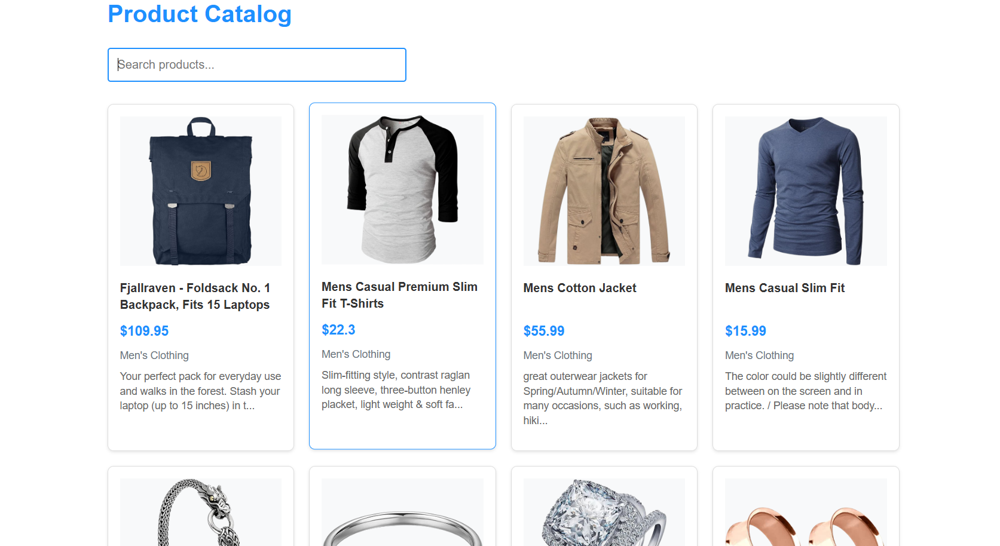
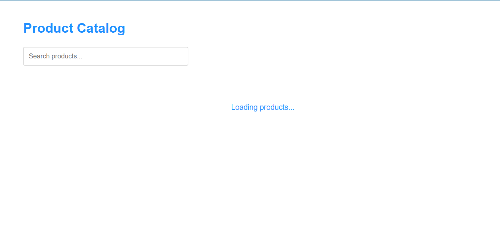
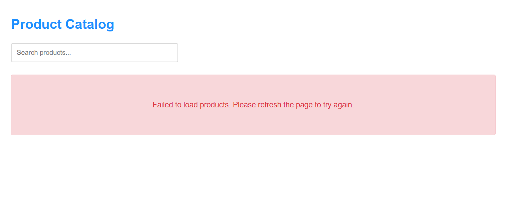
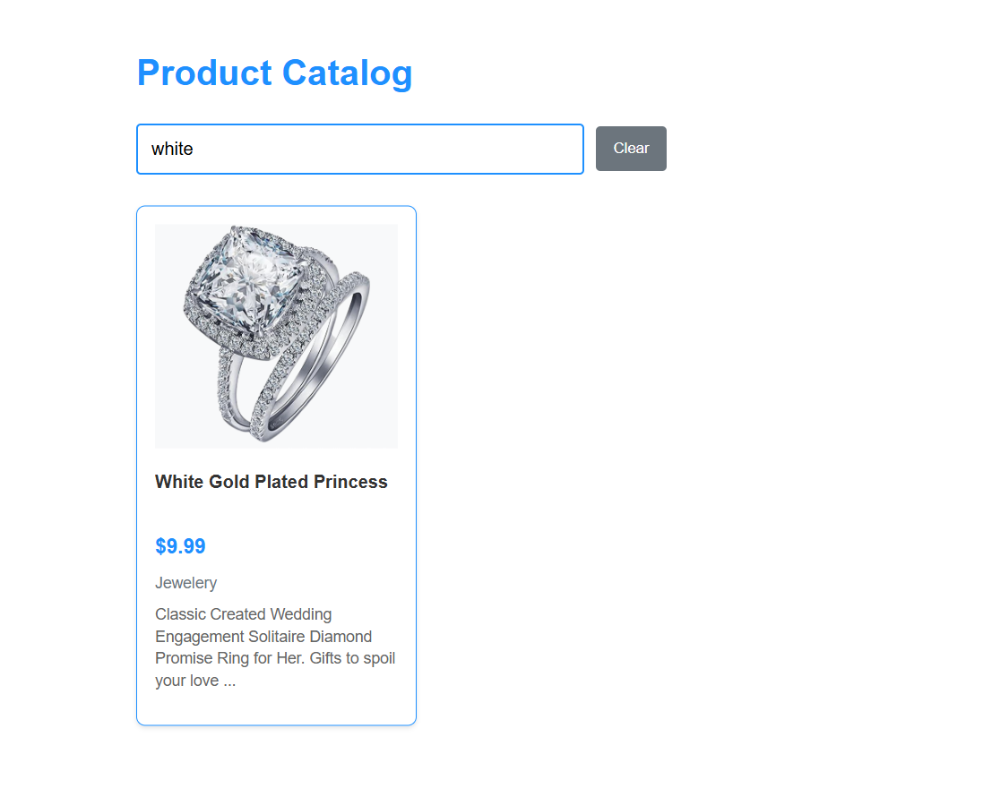
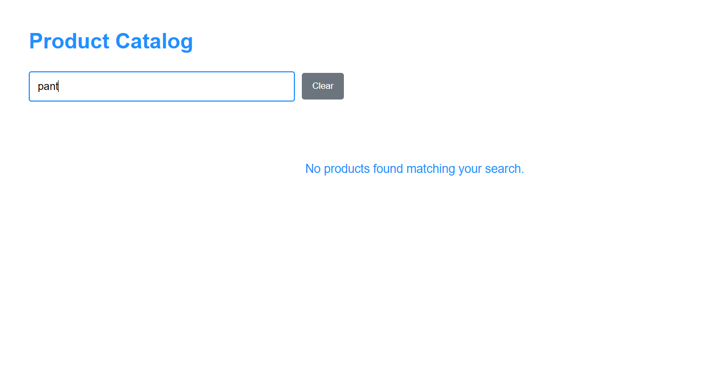

# Product Catalog App (GradedLab 03)

## Description

This is a third gradedLab React application that displays a product catalog with data fetched from an external API and allows real-time filtering by product name using React functional components, hooks, API integration, and state management as requested on the question.

## How to Run

1. **Move inside the project root:**
   ```bash
   cd gradedlab03
   ```

2. **Install dependencies:**
   ```bash
   npm install
   ```

3. **Start the development server:**
   ```bash
   npm run dev
   ```

4. **Open in browser:**
   ```
   http://localhost:5173
   ```

## Contents

1. App UI with Product Catalog
   

2. Loading State Display
   
   

3. Search Filter Functionality
   

4. No Results Found State
   

## Features

- Product catalog with API data fetching
- Real-time search filter by product name
- Loading state indicator
- Error handling for failed API requests
- Responsive grid layout
- Product cards with image, title, price, and category
- Case-insensitive search functionality
- Clear search option
- Built with React functional components and hooks
- Uses useEffect for data fetching and side effects
- State management for products, filtering, loading, and error states